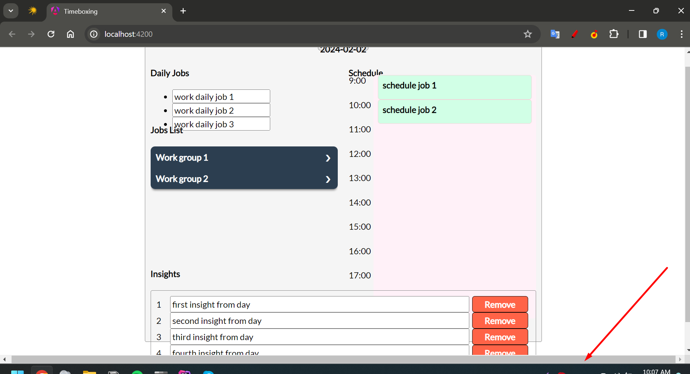
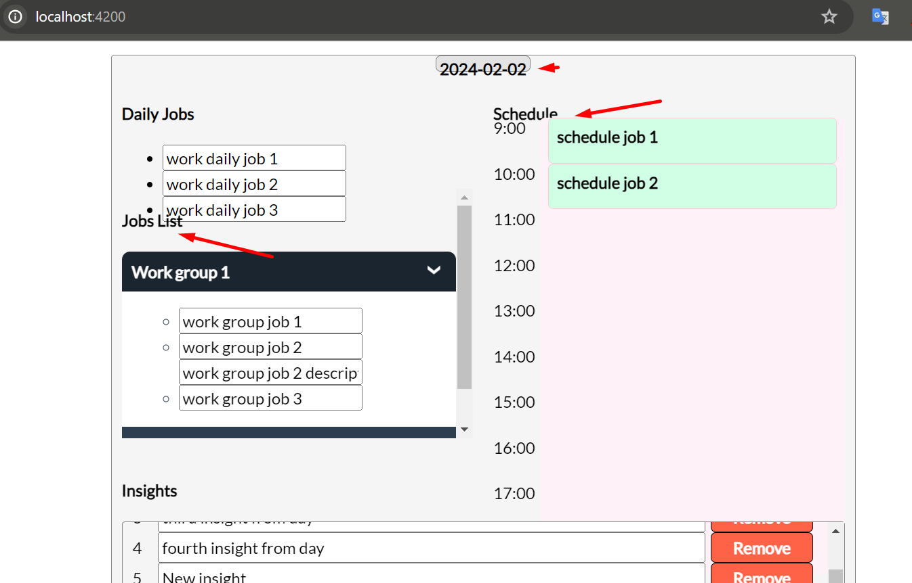

1. Программисты - народ ленивый. Чем опытнее программист, тем он ленивее. Если ты хочешь использовать этот проект на
   собесах то советую упростить процесс запуска проекта, иначе его никто даже пытаться не будет запускать (увы, но
   такова реальность). Например, можно прикрутить докер, чтобы не нужно было устанавливать зависимости и т.д.
2. Горизонтальный скролл - плохой знак. Значит ты где-то ошибся в верстке. 
3. Над дизайном стоит поработать
4. Хорошим UX считается показывать cursor: pointer на элементах, на которые можно кликнуть. Например, у тебя на кнопке
   "remove" не видно, что она кликабельна.
5. Многие элементы странно распологаются на экранах небольших (у меня
   ноут)  
6. UI не очень интуитивный. Не стоит переусложнять, ну или можно добавлять подсказки. Юзеры в большинстве своем глупые (
   я в том числе). Чем проще, тем лучше.
